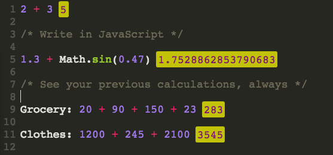

# Kalu

_Calculate at speed with automatic interlinked calculations_

---

'Kalu' is a calculator concept which aims at making long and inter-linked calculations really fast and intuitive.

### [DEMO](http://kushagragour.in/lab/kalu)



## Features

- No need to press ENTER to see your result. Keep typing.
- Always see your previous calculations
- **Automatic calculation references** - every calculation is automatically reusable
- **Visual reference system** - references are highlighted with tooltips showing what they point to
- **Interactive references** - hover to see the source, click to jump to it
- **Smart reference preservation** - references remain valid even when you:
  - Add or remove lines
  - Change calculation content
  - Move calculations around
- Live updates - when a calculation changes, all dependent calculations update automatically
- Full support for math.js functions and unit conversions
- Optional variable assignments for more readable calculations

## How to Use

1. Type calculations directly (e.g., `2 + 3`)
2. Click on any result (yellow block) to automatically insert its reference
3. Use these references in subsequent calculations
4. Hover over any reference to see what calculation it points to
5. Click on a reference to jump to the original calculation
6. Edit your document freely - references will be preserved intelligently

## Reference Visualization

Each calculation reference is now:

- **Highlighted** - references stand out with a distinct color
- **Informative** - hover over a reference to see what calculation it points to
- **Interactive** - click a reference to jump to the original calculation

This makes it much easier to understand and navigate complex calculations with many dependencies.

## Calculation References

Each calculation is automatically assigned a unique ID that persists regardless of edits to your document. These references can be used in subsequent calculations to create dependencies.

For example:

```
2 + 3         // Result: 5 (referenced as _calc0)
_calc0 * 4    // Result: 20 (uses the result of the first calculation)
```

The calculator uses a smart tracking system to preserve references when you:

- Add or remove lines between calculations
- Change the content of a calculation
- Move calculations to different positions

## License

Copyright (c) 2015 Kushagra Gour, http://kushagragour.in
Licensed under the [MIT license](http://opensource.org/licenses/MIT).
